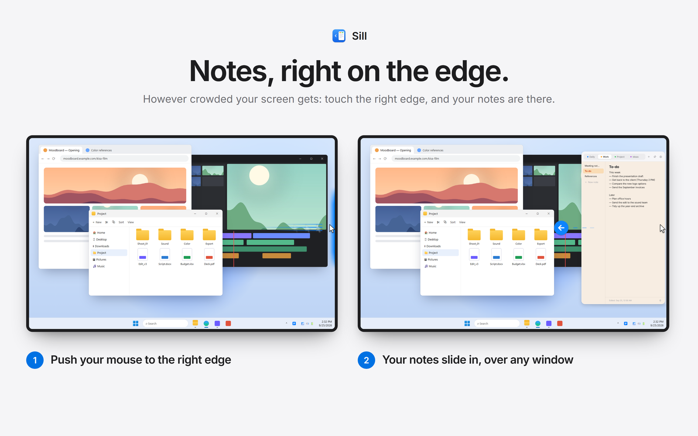
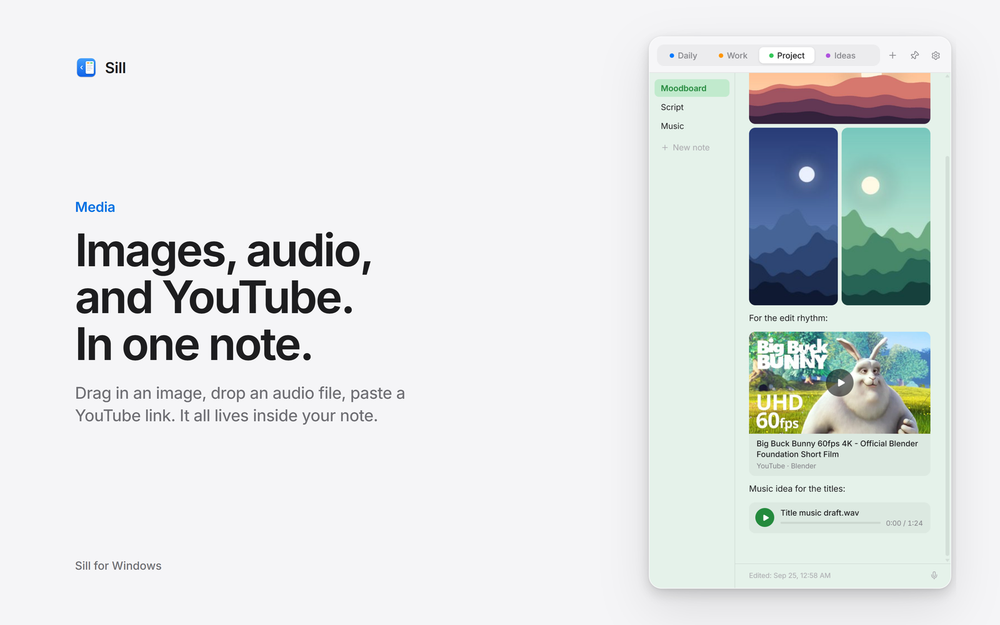
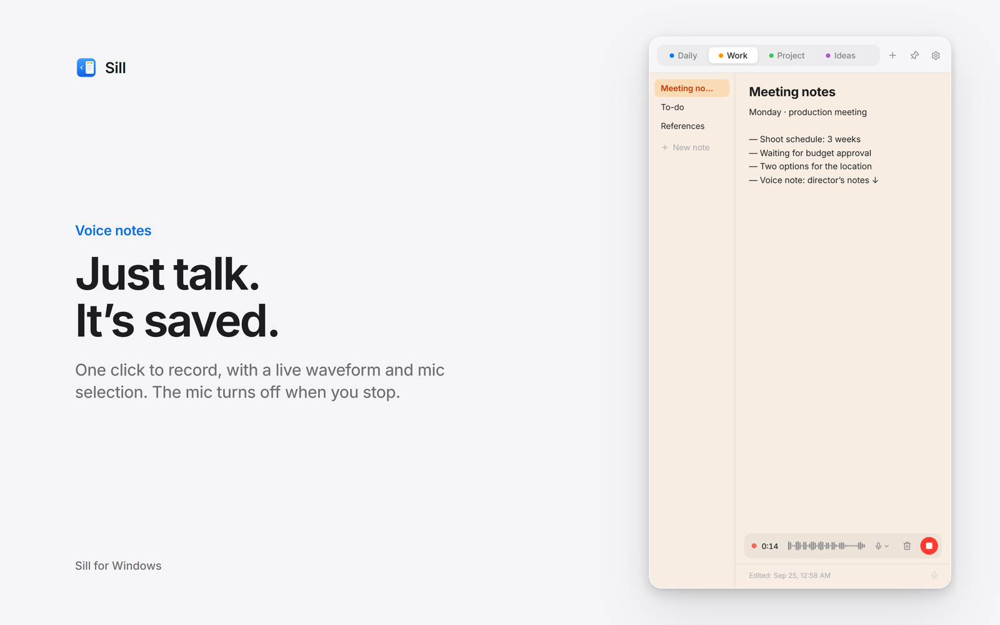
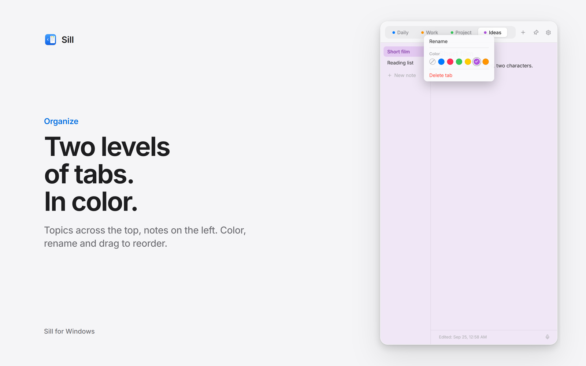
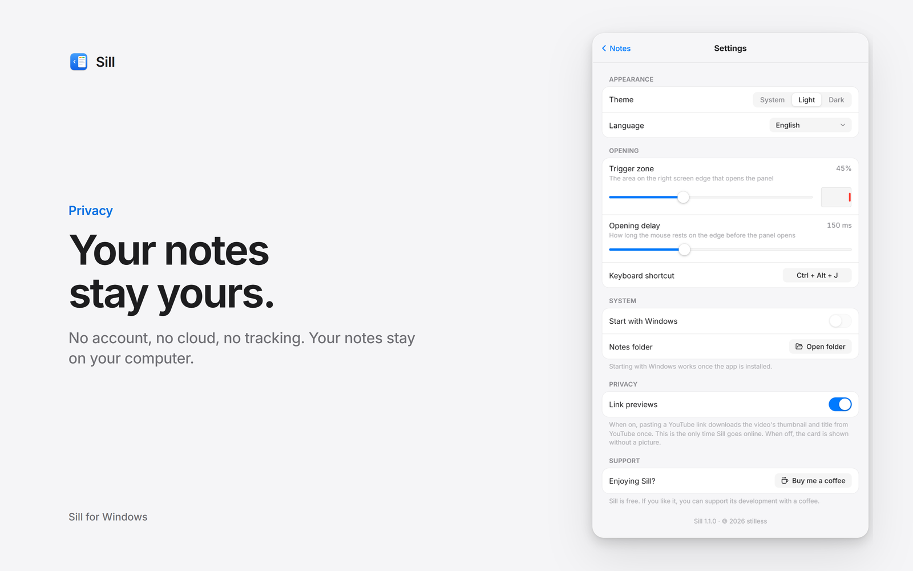

# Sill

[English](README.md) · [Türkçe](README.tr.md) · [Deutsch](README.de.md) · [Français](README.fr.md) · [Español](README.es.md) · [Português](README.pt-BR.md) · [Italiano](README.it.md) · [Русский](README.ru.md) · **日本語** · [简体中文](README.zh-CN.md)

**Windows の画面の端に住む、無料のメモパネル。**
マウスを右端に動かすと、どのウィンドウの上にもパネルがすっと現れます。離れれば、すっと戻ります。アカウントもクラウドも追跡もありません。

**[⬇ Windows 版をダウンロード](../../releases/latest)** · Microsoft Store（近日公開） · **[Web サイト](https://adwatch1.github.io/sill/)**

---

## 機能

- **画面端で開く。** マウスを画面右端の中央に置くか、`Ctrl + Alt + N` を押します。
- **2 段のタブ。** 上にトピック、左にメモ。色分け・名前の変更・並べ替えができます。
- **自動で保存。** 保存ボタンはありません。
- **画像。** ドラッグ＆ドロップ、`Ctrl + V` で貼り付け、または右クリック → 画像を追加。
- **音声とボイスメモ。** 音声ファイルをドロップ、またはマイクで録音（波形をリアルタイム表示）。
- **YouTube カード。** YouTube のリンクを貼ると、サムネイルとタイトル付きのカードになります。
- **10 言語。** Windows の言語に自動で合わせます。
- ライト / ダーク テーマ、パネルの固定、幅の調整、Windows の起動時に開始。

| | |
|---|---|
|  |  |
|  |  |

## インストール

[Releases](../../releases/latest) から `Sill-Setup-x.y.z.exe` をダウンロードして実行します（管理者権限は不要）。直接ダウンロード版はまだ署名されていないため、初回は Windows が警告することがあります：**詳細情報 → 実行**。Microsoft の署名付きで自動更新される Microsoft Store 版も近日公開予定です。

## プライバシー

メモ、画像、音声、設定はすべてあなたのパソコンにのみ保存されます。Sill がインターネットに接続するのは、YouTube のリンクを貼り付けてサムネイルとタイトルを一度だけ取得するときだけです（設定 → プライバシーでオフにできます）。マイクは録音中のみ使用します。[プライバシーポリシー](https://adwatch1.github.io/sill/privacy.html)

## 応援

Sill は無料です。気に入ったら [コーヒーをおごってください ☕](https://buymeacoffee.com/stilless)。

## ライセンス

無料でダウンロード・利用できます。© 2026 stilless. All rights reserved. ソースコードは透明性のために公開していますが、オープンソースではありません。[LICENSE](LICENSE) をご覧ください。
お問い合わせ: [mailatikleri@gmail.com](mailto:mailatikleri@gmail.com)

---

スクリーンショットはサンプルの内容です。動画サムネイル：*Big Buck Bunny* © Blender Foundation, [CC BY 3.0](https://creativecommons.org/licenses/by/3.0/)
