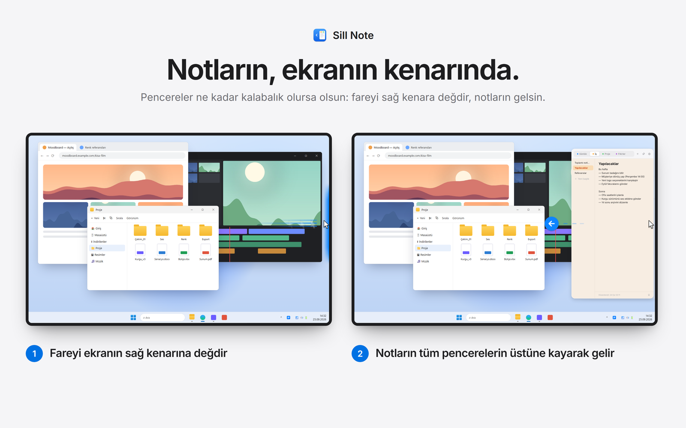
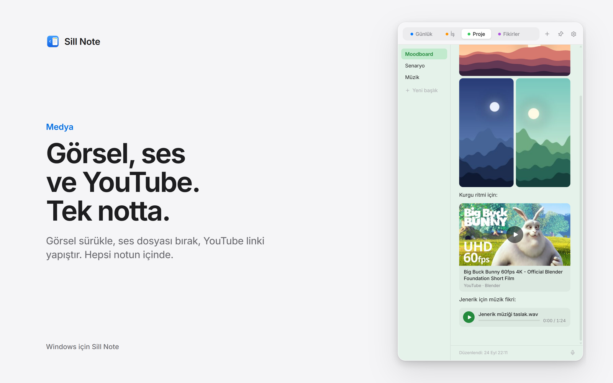
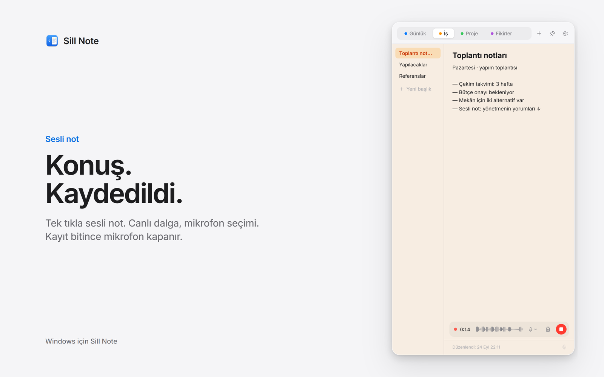
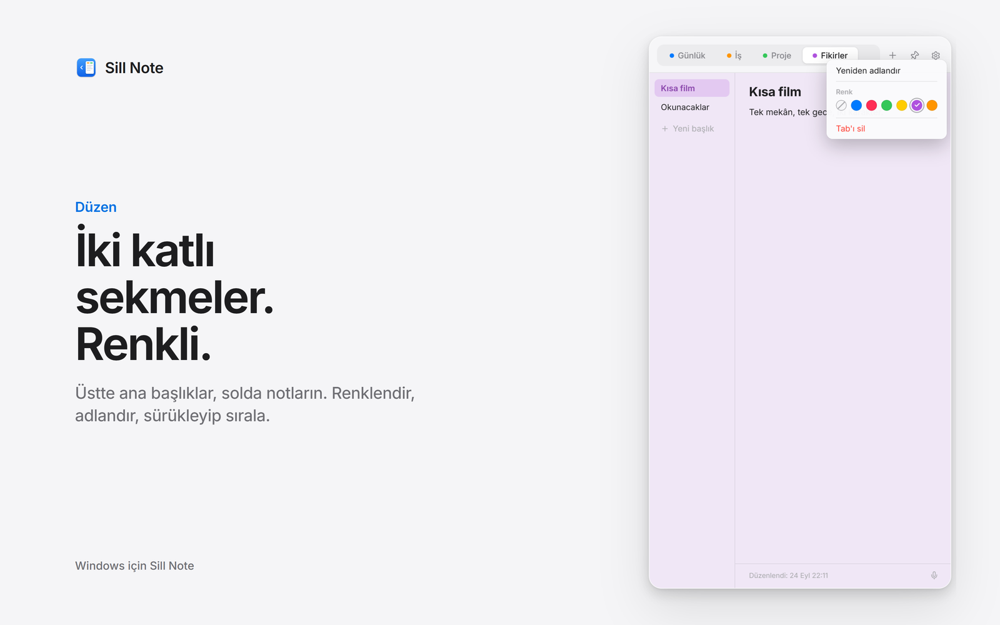
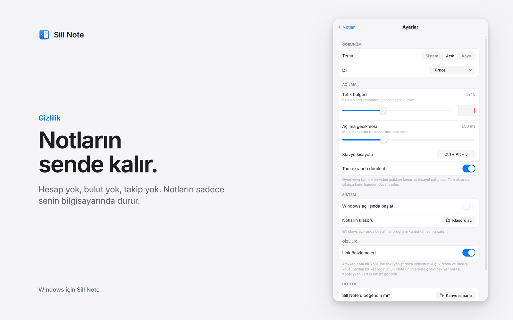

# Sill Note

[English](README.md) · **Türkçe** · [Deutsch](README.de.md) · [Français](README.fr.md) · [Español](README.es.md) · [Português](README.pt-BR.md) · [Italiano](README.it.md) · [Русский](README.ru.md) · [日本語](README.ja.md) · [简体中文](README.zh-CN.md)

**Windows ekranının kenarında duran, ücretsiz bir not paneli.**
Fareyi sağ kenara götür, panel her pencerenin üstüne kayarak gelsin. Uzaklaş, geri çekilsin. Hesap yok, bulut yok, takip yok.

**[⬇ Windows için indir](https://github.com/adwatch1/sill/releases/latest/download/SillNote-Setup.exe)** · Microsoft Store (çok yakında) · **[Web sitesi](https://www.sillnote.store/)**

---

## Özellikler

- **Kenar tetiği.** Fareyi ekranın sağ kenarının ortasında beklet ya da `Ctrl + Alt + N`’ye bas.
- **İki katlı sekmeler.** Üstte ana başlıklar, solda notlar. Renklendir, adlandır, sırala.
- **Kendiliğinden kaydedilen notlar.** Kaydet düğmesi yok.
- **Görseller.** Sürükle-bırak, `Ctrl + V` ile yapıştır ya da sağ tık → Görsel ekle.
- **Ses ve sesli not.** Ses dosyası bırak ya da mikrofondan canlı dalgayla kaydet.
- **YouTube kartları.** YouTube linki yapıştır, küçük resimli ve başlıklı karta dönüşsün.
- **10 dil.** Windows’un dilini kendiliğinden takip eder.
- Açık ve koyu tema, paneli açık tutan raptiye, boyutlandırılabilir panel, Windows açılışında başlatma.

| | |
|---|---|
|  |  |
|  |  |

## Kurulum

[Releases](../../releases/latest) sayfasından `SillNote-Setup.exe` dosyasını indirip çalıştır (yönetici izni gerekmez). Doğrudan indirilen kurulum henüz imzalı değil; Windows ilk seferde uyarabilir: **Ek bilgi → Yine de çalıştır**. Microsoft imzalı ve kendiliğinden güncellenen Microsoft Store sürümü çok yakında. Kurmak istemiyor musun? Taşınabilir [ZIP](https://github.com/adwatch1/sill/releases/latest/download/SillNote-Portable.zip)'i indir, istediğin klasöre aç ve `Sill.exe`'yi çalıştır.

## Gizlilik

Notların, görsellerin, seslerin ve ayarların sadece bilgisayarında kalır. Sill Note yalnızca tek bir durumda internete çıkar: YouTube linki yapıştırdığında o videonun küçük resmini ve başlığını bir kez indirir (Ayarlar → Gizlilik’ten kapatılabilir). Mikrofon sadece kayıt sırasında açıktır. [Gizlilik politikası](https://www.sillnote.store/privacy.html)

## Destek

Sill Note ücretsiz. Beğendiysen [bir kahve ısmarlayabilirsin ☕](https://buymeacoffee.com/stilless).

## Lisans

İndirmek ve kullanmak ücretsiz. © 2026 stilless. Tüm hakları saklıdır. Kaynak kod şeffaflık için açıktır ama açık kaynak lisanslı değildir — bkz. [LICENSE](LICENSE).
İletişim: [mailatikleri@gmail.com](mailto:mailatikleri@gmail.com)

---

Ekran görüntülerinde örnek içerik kullanıldı. Video görseli: *Big Buck Bunny* © Blender Foundation, [CC BY 3.0](https://creativecommons.org/licenses/by/3.0/).
